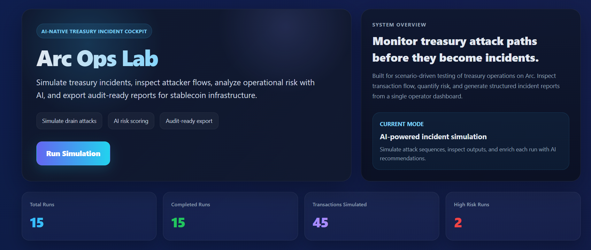

# Arc Ops Lab



**AI-powered treasury incident simulation and risk analysis dashboard for Arc.**

Arc Ops Lab is a security-focused product demo designed to simulate treasury drain incidents, inspect attacker transaction flows, generate AI-based risk assessments, and export structured incident reports.

## Live Demo

- **Production URL:** https://arc.scanlyai.app

## What it does

Arc Ops Lab provides a focused workflow for treasury security simulation:

- Simulate treasury attack scenarios
- Track generated attacker transaction flows
- Run AI-powered risk analysis
- Export incident reports
- Review incident runs in a production-style dashboard

## Core Features

### 1. Incident Simulation
Create and inspect simulated treasury attack runs with scenario-based transaction generation.

### 2. AI Risk Analysis
Each run can be analyzed with AI to produce:

- risk score
- severity level
- insight summary
- mitigation recommendation

### 3. Attack Timeline
Visualize simulated attacker transaction flow in a clean operator dashboard.

### 4. Report Export
Download structured incident reports for audit, review, or demo purposes.

### 5. Production Deployment
The project is deployed behind Nginx with SSL and served on a custom domain.

## Tech Stack

- **Next.js**
- **TypeScript**
- **Prisma**
- **SQLite**
- **OpenAI API**
- **Nginx**
- **Ubuntu / VPS deployment**

## Project Structure

```bash
app/
components/
lib/
prisma/
public/
workers/
